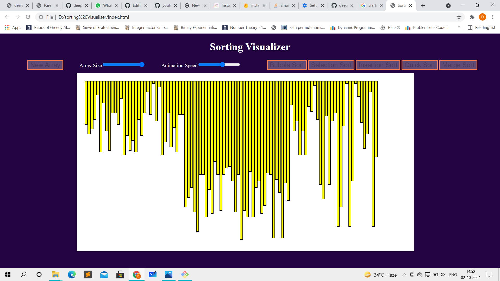
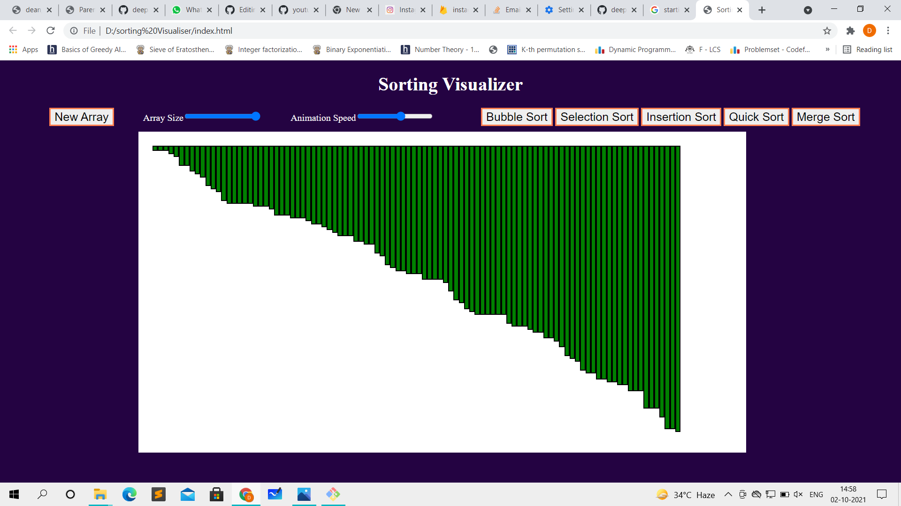
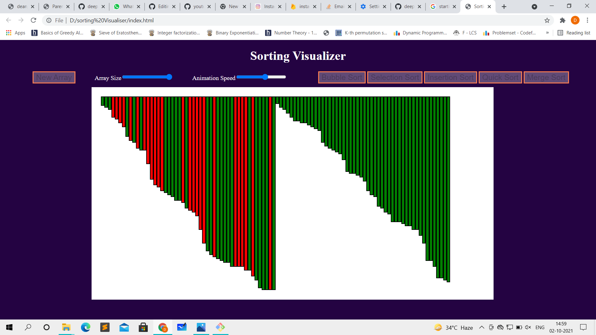
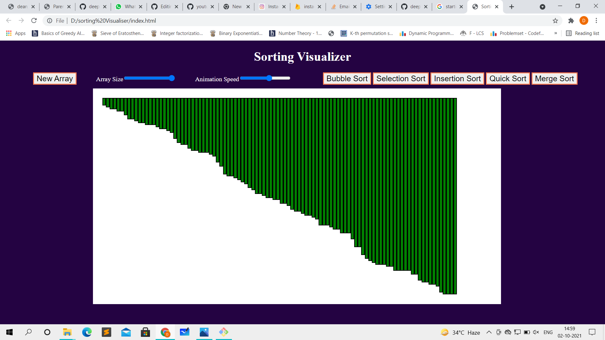

# Sorting Visualiser

A web application to visualise the working of different sorting algorithms such as bubble sort, merge sort, insertion sort and others.

Technology used  


#### Clone the project

```bash
  git clone https://github.com/deepanshusingh-hub/sorting_visualiser

````




